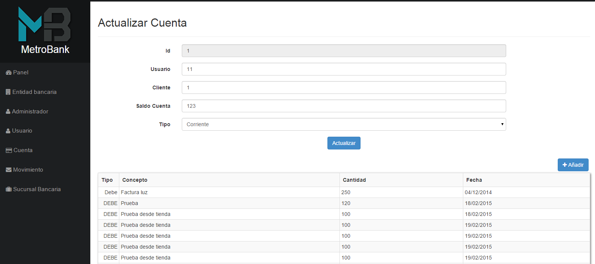

<h1><a href="http://banco-slem.rhcloud.com/">MetroBank</a></h1>

Bank project for DAW

<h3>Tecnologies</h3>
<ul>
  <li>Java</li>
  <li>Spring</li>
  <li>Hibernate</li>
  <li>AngularJs</li>
  <li>MySql</li>
  <li>Sass</li>
  <li>Jasypt</li>
  <li>Bootstrap</li>
  <li>JS</li>
  <li>JQuery</li>
  <li><a href="http://flywaydb.org/">FlywayDB</a></li>
</ul>

<h3>Features</h3>
<ul>
  <li>Simple Bootstrap template</li>
  <li><a href="http://banco-slem.rhcloud.com/empleado/">Administration</a></li>
  <li>Api for payments</li>
  <li>Acounts</li>
  <li>Users</li>
  <li>Login</li>
  <li>Accounts, movements...etc</li>
  <li>Sessions</li
</ul>

<h3>Scheenshots</h3>
<h4>Front</h4>

<h4>Back</h4>

